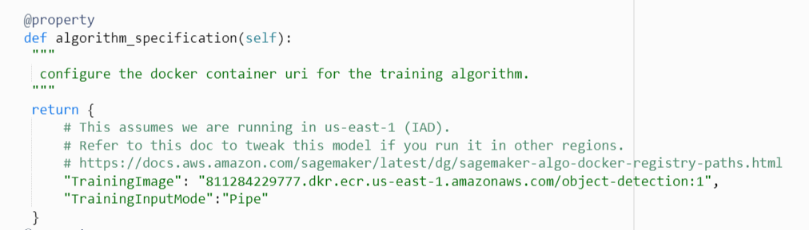
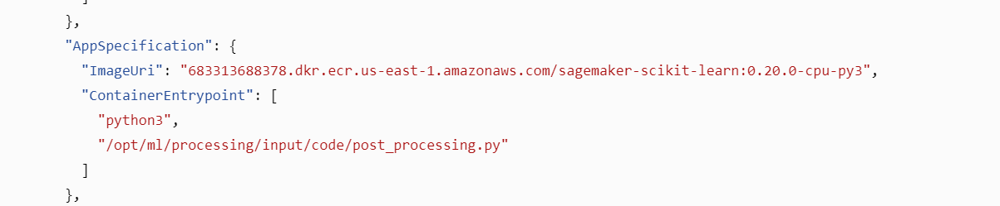

<h1>Amazon SageMaker custom object detection workflows with active learning</h1>

Active Learning is the process of labeling some fraction of unlabeled dataset by humans which is then fed into the training model. The model is then inferenced to label the remaining part of dataset and provide a confidence score on each of its record. A subset of records which are labeled with low confidence are provided to human for labeling, which is in turn used to retrain the model to improve its performance and label the remaining data which was previously labeled by the model with low confidence score. This loop goes on until entire data is labeled with high confidence score.

In short, in active learning difficult data objects are sent to human workers to be annotated and easy data objects are automatically labeled with machine learning (automated labeling or auto-labeling).

<b>Amazon SageMaker Ground Truth</b> can be easily and inexpensively used to build accurately labeled machine learning (ML) datasets. Active learning can be used with SageMaker Ground Truth to reduce the labeling cost. 
This post can be used to  create an active learning workflow for object detection(bounding box) task using SageMaker in-built algorithm to run training and inference in that workflow. This example can be used as a starting point to perform active learning and auto annotation with a <b>custom labeling job</b>.

<h3>Prerequisites and necessary setup</h3>

To create a custom object detection active learning workflow using this post, you need to fulfill the following prerequisites:

<ul>
<li>Create an <a href = "https://signin.aws.amazon.com/signin?redirect_uri=https%3A%2F%2Fportal.aws.amazon.com%2Fbilling%2Fsignup%2Fresume&client_id=signup">AWS account</a>.</li>
<li>Create a <a href="https://docs.aws.amazon.com/sagemaker/latest/dg/howitworks-create-ws.html"> Amazon SageMaker Jupyter notebook instance</a>. We have created and tested the workflow in an <code>ml.m4.xlarge</code> instance. </li>
<li>Create an IAM role with the permissions required to complete this workflow and attach it to the notebook instance you are using. Ensure that the IAM role have the following AWS managed policies attached:</li>
<ul shape = "disc">
<li>IAMFullAccess</li>
<li>CloudWatchFullAccess</li>
<li>AWSLambda_FullAccess</li>
<li>AWSStepFunctionsFullAccess</li>
<li>AmazonSageMakerFullAccess</li>
<li>AWSCloudFormationFullAccess</li>
<li>AmazonS3FullAccess</li>
</ul>
<li>Ensure that CORS is enabled on the s3 bucket you are going to use. Else Private worker would not be able to perform the labeling job assigned. You can enable CORS in the s3 bucket by following the link <a href = "https://docs.aws.amazon.com/AmazonS3/latest/userguide/enabling-cors-examples.html"> Enable CORS</a>.</li>
<li>Install <a href = "https://docs.aws.amazon.com/serverless-application-model/latest/developerguide/serverless-sam-cli-install.html">AWS SAM CLI</a> in the notebook instance. </li>
<li>Familiarity with Amazon SageMaker <a href="https://docs.aws.amazon.com/sagemaker/latest/dg/sms.html">labeling</a>, <a href = "https://docs.aws.amazon.com/sagemaker/latest/dg/train-model.html">training</a> and <a href= "https://docs.aws.amazon.com/sagemaker/latest/dg/batch-transform.html">batch transform</a>; <a href = "https://docs.aws.amazon.com/AWSCloudFormation/latest/UserGuide/Welcome.html"> AWS CloudFormation</a>; and <a href = "https://docs.aws.amazon.com/step-functions/latest/dg/welcome.html">Step Functions</a>.</li>
</ul>

Use<code> active-learning-object-detection.ipynb</code> notebook in an Amazon SageMaker Jupyter notebook instance to create the resources needed in your active learning workflow.

<h3>For launching the workflow in the region other than <code> us-east-1</code> </h3>

 In the <code> active-learning-object-detection.ipynb</code> notebook, we have demonstrated to launch the cloud formation stack in  <code> us-east-1</code>  region, but if you want to use it in any other region, then after launching the stack in your preferred region as mentioned in the notebook <code> active-learning-object-detection.ipynb</code>, perform the following necessary edits

<ol>
    <li>On the AWS Lambda console, locate the Lambda function with the name <b>*-PrepareForTraining-<###></b> where * is the name you used when you launched your CloudFormation stack and -<###> is a list of letters and numbers.</li>
    <li>Identify the existing algorithm specification, which looks like the following code:</li>
        </img>
    <li>Change the value of  <b>TrainingImage</b> key to training image uri of the sagemaker object detection model of your region. Check the following link to get the  training image uri:- <a href="https://docs.aws.amazon.com/sagemaker/latest/dg/sagemaker-algo-docker-registry-paths.html ">Sagemaker-algo-docker-registry</a>. After edit, save the lamda function and click on <b>deploy</b> button. </li> 
    <li>On the AWS Step Functions console, choose State Machines.</li>
    <li>Select the radio button near <b>ActiveLearning-*</b></li>
    <li>Choose <b> Edit.</b></li>
    <li>Look for the <b>Inference post-processing step</b>  state, this step is responsible for invoking the sagemaker processing job which performs necessary post-processing in the output generated by the object detection model.</li>
    <li> In this step, look for <b>AppSpecification</b>, which looks like the following code:</li>
    </img>
    <li>Here change the value of <b>ImageUri</b> key according to the pre-built sklearn container image uri of your region. Check the following link to get the  container image uri:- <a href="https://docs.aws.amazon.com/sagemaker/latest/dg/pre-built-docker-containers-scikit-learn-spark.html ">Sagemaker Pre-built Sklearn container<a/> </li>
    
</ol>    
